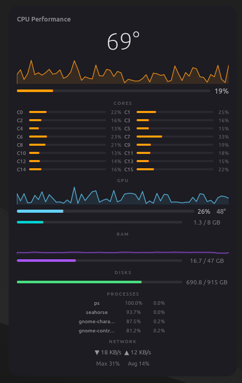

# Core Pulse



A lightweight system monitor and MCP server for Linux. Built with Rust + GTK4 — ~740KB binary, zero bloat.

Dual mode: launch the GUI widget, or use the MCP server to give AI agents real-time system stats.

## Features

- **CPU** per-core usage, aggregate sparkline (2min), temperature
- **GPU** core util, VRAM, temperature (NVIDIA)
- **RAM** used/total with sparkline
- **Disk** root partition usage
- **Network** real-time up/down speed
- **Top processes** by CPU
- **Draggable & resizable** window
- **MCP server** — stdin/stdout JSON-RPC for AI agents

## MCP Server for AI Agents

Core Pulse doubles as an [MCP](https://modelcontextprotocol.io) server. AI agents (Claude Desktop, Cline, Cursor, etc.) can query real-time hardware stats without any daemon, HTTP port, or configuration.

### Tools exposed

| Tool | Returns |
|------|---------|
| `get_cpu_usage` | Per-core + aggregate usage %, temperature, core count |
| `get_gpu_stats` | GPU core %, VRAM used/total, temperature |
| `get_ram_stats` | RAM used/total GB, percentage |
| `get_disk_stats` | Disk usage for a mount point (default `/`) |
| `get_network_speed` | Real-time download/upload with interface name |
| `get_top_processes` | Top N processes by CPU (default 5) |

### Usage with AI agents

**Claude Desktop / Cline / any MCP client:**

Add to your MCP config (`~/.config/opencode/mcp.json` or `claude_desktop_config.json`):

```json
{
  "mcpServers": {
    "core-pulse": {
      "command": "core-pulse",
      "args": ["mcp"]
    }
  }
}
```

Then in your AI agent prompt:

> "What's my current CPU and RAM usage?"
> "Show me the top 5 processes by CPU"
> "How much disk space is free?"

The agent will call the corresponding tools and respond with live data.

### Test manually

```bash
# List available tools
echo '{"jsonrpc":"2.0","id":1,"method":"tools/list"}' | core-pulse mcp

# Get CPU usage (takes ~200ms for a fresh sample)
echo '{"jsonrpc":"2.0","id":1,"method":"tools/call","params":{"name":"get_cpu_usage","arguments":{}}}' | core-pulse mcp

# Get RAM stats
echo '{"jsonrpc":"2.0","id":1,"method":"tools/call","params":{"name":"get_ram_stats","arguments":{}}}' | core-pulse mcp
```

## Install

### From release

```bash
# tar.gz
tar xzf core-pulse-v0.2.0-linux-x86_64.tar.gz
./install.sh          # user install (~/.local/bin)
# or
sudo ./install.sh --system  # system-wide (/usr/local/bin)

# .deb
sudo dpkg -i core-pulse_0.2.0_amd64.deb
```

Both methods install `core-pulse` to your PATH. The MCP server and GUI widget are the **same binary** — just use `core-pulse mcp` for the server or `core-pulse` for the GUI.

### From source

```bash
sudo apt install libgtk-4-dev   # Ubuntu/Debian
# or
sudo dnf install gtk4-devel      # Fedora

cargo install --git https://github.com/YOUR_USER/core-pulse
```

## Usage

```bash
core-pulse          # Launch GUI widget
core-pulse mcp      # Start MCP server (stdin/stdout)
```

### GUI controls
- **Drag** anywhere on the window to move it
- **Resize** by dragging the edges
- **Close** with Ctrl+C in the terminal

## Requirements

- Linux x86_64 with X11 or Wayland
- GTK 4.14+ (preinstalled on Ubuntu 24.04+, Fedora 39+) — only needed for GUI
- NVIDIA GPU with `nvidia-smi` for GPU stats (optional)

## Build Dependencies

| Package | Ubuntu/Debian | Fedora |
|---------|---------------|--------|
| GTK4 dev | `libgtk-4-dev` | `gtk4-devel` |
| Rust | `rustc cargo` | `rust cargo` |

## License

MIT
